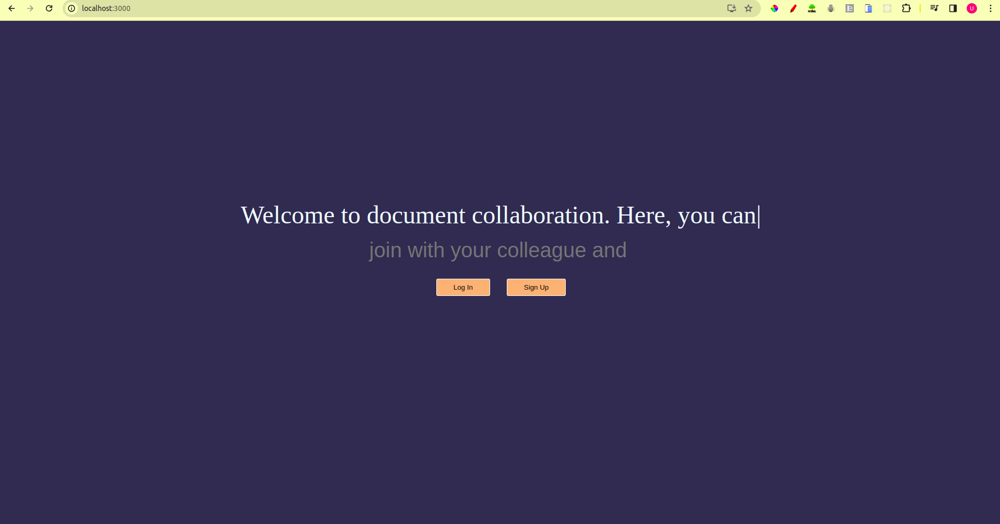
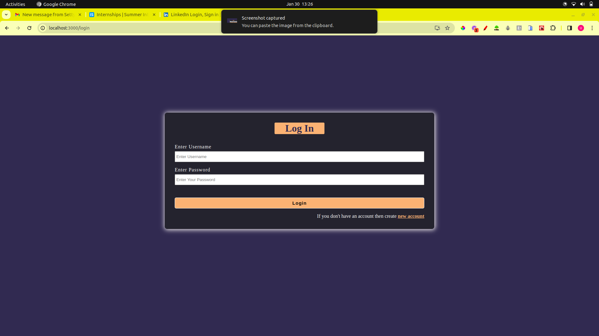

# Getting Started with Create React App

This project was bootstrapped with [Create React App](https://github.com/facebook/create-react-app).

## Available Scripts

In the project directory, you can run:

### `npm start`
### `npm run server:dev`


# please make sure your mongoDB is running on 
```
port:27017
```







